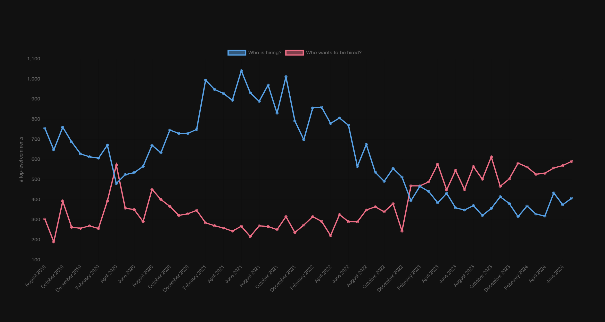

# Hacker News `whoishiring` Historical Stats



Brief background: wanted to leverage the Hacker News API to get a sense of the
hiring trends over the past 5 years, specifically given the COVID pandemic and
the fall & rise of US Federal Reserve interest rates.

Read more. _Coming soon._

Setup:

- <https://deno.com/>

Run:

```sh
deno run --allow-net index.ts
```

Usage within Chart.js:

```sh
deno run --allow-net index.ts | pbcopy
```

`pbcopy` isn't Mac-exclusive: <https://github.com/Pinjasaur/dotfiles/blob/44f3d06a7a71727fab5e4a5b7b3190a579476e94/.aliases#L33-L40>

## Inspiration

- <https://news.ycombinator.com/item?id=40877136>

## Related

- <https://github.com/bobbywilson0/hn-whos-hiring/>
